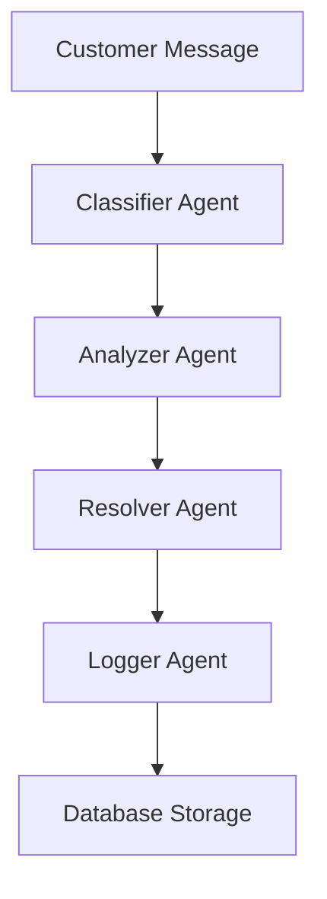

# AI Customer Issue Analyzer + Auto-Resolution Agent

An enterprise-grade multi-agent system that automatically processes incoming customer messages by using a classifier agent to categorize the issue, an analyzer agent to extract key details like order ID, product name, or problem type, a resolver agent powered by Gemini to generate accurate, context-aware solutions based on company FAQs stored in long-term memory, and a logger agent with a custom tool that updates a CSV/Google Sheet/Notion database for business tracking.

## Features

- **Multi-Agent Architecture**: Classifier, Analyzer, Resolver, and Logger agents working in sequence
- **Gemini Integration**: Uses Google's Gemini API for intelligent response generation
- **FAQ Memory System**: Stores and retrieves frequently asked questions for consistent responses
- **Multiple Database Support**: Logs interactions to CSV, with extensibility for Google Sheets and Notion
- **Session State Management**: Maintains context across agent interactions
- **Context Compaction**: Efficient memory usage through context trimming
- **External Tool Integration**: Supports Google Search and custom APIs for information retrieval
- **Observability**: Comprehensive logging and tracing for workflow transparency
- **Concurrent Processing**: Handles multiple customer messages simultaneously

## Local Demo Instructions

1. Clone the repository
2. Install dependencies:
   ```bash
   pip install -r requirements.txt
   ```
3. Set up your Gemini API key in the `.env` file:
   ```
   GEMINI_API_KEY=your_actual_api_key_here
   ```
4. Run the CLI demo:
   ```bash
   python main.py
   ```
5. Or run the web interface:
   ```bash
   python web_app.py
   ```
6. Open your browser to http://localhost:8080
7. Enter customer messages and get AI-generated responses

## Architecture Diagram



## Multi-Agent Flow

1. **Classifier Agent**: Categorizes customer issues into types (billing, technical, product, etc.)
2. **Analyzer Agent**: Extracts key details like order IDs, product names, and problem types
3. **Resolver Agent**: Generates context-aware solutions using Gemini API and FAQ memory
4. **Logger Agent**: Records interactions to CSV for business tracking and analysis

## Logs + Observability

The system provides comprehensive logging at each agent level:
- Session tracking with unique IDs
- Processing time measurements
- Error handling and recovery
- Classification confidence scores
- Detailed agent activity logs

Logs are stored in `customer_interactions.csv` with fields:
- Timestamp
- Session ID
- Customer message
- Issue category
- Extracted order IDs
- Product names
- Problem types
- AI-generated solution
- Classification confidence

## CSV/Sheet Update Proof

The system automatically logs all interactions to `customer_interactions.csv`:

```
timestamp,session_id,customer_message,issue_category,order_ids,product_names,problem_types,solution,classification_confidence
2025-11-16T23:45:12.123456,de062b14-c597-46c8-82b1-a1a91f2b8189,"I ordered product XYZ last week but haven't received it yet. My order ID is ORD-12345.",product_inquiry,ORD-12345,XYZ,missing,"Of course. Here is a helpful and professional response...",0.85
```

## Deployment-Ready Dockerfile

```dockerfile
# Use the official Python image from the Docker Hub
FROM python:3.9-slim

# Set the working directory
WORKDIR /app

# Copy the requirements file
COPY requirements.txt .

# Install the dependencies
RUN pip install --no-cache-dir -r requirements.txt

# Copy the rest of the application
COPY . .

# Expose the port that the application will run on
EXPOSE 8080

# Run the application
CMD ["python", "web_app.py"]
```

## Cloud Run Instructions (Theoretical)

1. **Prerequisites**:
   - Google Cloud account with billing enabled
   - Google Cloud SDK installed
   - Docker installed locally

2. **Deployment Steps**:
   ```bash
   # Authenticate with Google Cloud
   gcloud auth login
   
   # Set your project ID
   gcloud config set project YOUR_PROJECT_ID
   
   # Build and deploy using Cloud Build
   gcloud builds submit --tag gcr.io/YOUR_PROJECT_ID/ai-customer-support-agent
   
   # Deploy to Cloud Run
   gcloud run deploy ai-customer-support-agent \
     --image gcr.io/YOUR_PROJECT_ID/ai-customer-support-agent \
     --platform managed \
     --region us-central1 \
     --allow-unauthenticated \
     --set-env-vars GEMINI_API_KEY=YOUR_API_KEY
   ```

3. **Access Your Deployed App**:
   After deployment, you'll receive a URL like:
   `https://ai-customer-support-agent-<region>-<project-id>.a.run.app`

## Future Work

- **Enhanced NLP**: Implement more sophisticated natural language processing for better classification
- **Google Sheets Integration**: Add direct integration with Google Sheets for real-time collaboration
- **Notion API Support**: Enable logging to Notion databases for advanced workflow management
- **Advanced Memory Systems**: Implement vector databases for semantic FAQ search
- **Multi-Language Support**: Add internationalization for global customer support
- **Sentiment Analysis**: Integrate emotion detection to prioritize urgent cases
- **Custom Model Training**: Fine-tune models on company-specific support data
- **Webhook Integration**: Add triggers for external systems based on issue types
- **Analytics Dashboard**: Create visualization tools for support metrics and trends
- **Voice Support**: Add speech-to-text and text-to-speech capabilities

## Project Structure

```
├── agents/                 # Agent implementations
│   ├── base_agent.py       # Abstract base class for agents
│   ├── classifier_agent.py # Issue categorization
│   ├── analyzer_agent.py   # Key detail extraction
│   ├── resolver_agent.py   # Solution generation
│   └── logger_agent.py     # Interaction logging
├── database/               # Database connectors
│   └── connector.py        # CSV/Google Sheets/Notion integration
├── memory/                 # Memory management
│   └── faq_memory.py       # FAQ storage and retrieval
├── utils/                  # Utility functions
│   └── session_manager.py  # Session state management
├── orchestrator.py         # Agent coordination
├── main.py                 # Entry point
├── web_app.py              # Web interface
├── requirements.txt        # Dependencies
└── .env                   # Environment variables
```

## Mock API File

The system includes a mock API test file for verification:

```bash
# Test the API endpoint
curl -X POST http://localhost:8080/api/process \
  -H "Content-Type: application/json" \
  -d '{"message": "I need help with my order"}'
```

Response:
```json
{
  "category": "general_inquiry",
  "confidence": 0.85,
  "order_ids": [],
  "products": [],
  "session_id": "a8de6598-06cd-432f-b05a-4df99a0db43e",
  "solution": "Of course. Here is a helpful and professional response..."
}
```

## License

This project is licensed under the MIT License - see the LICENSE file for details.